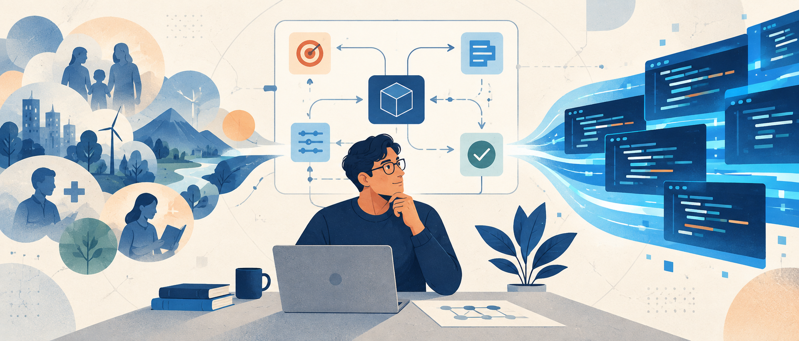
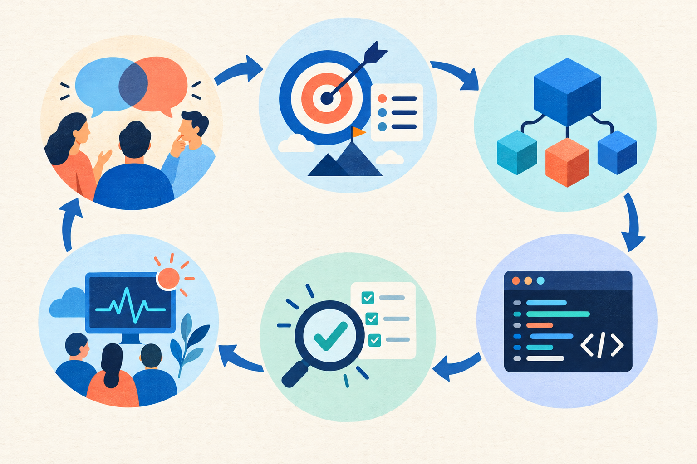
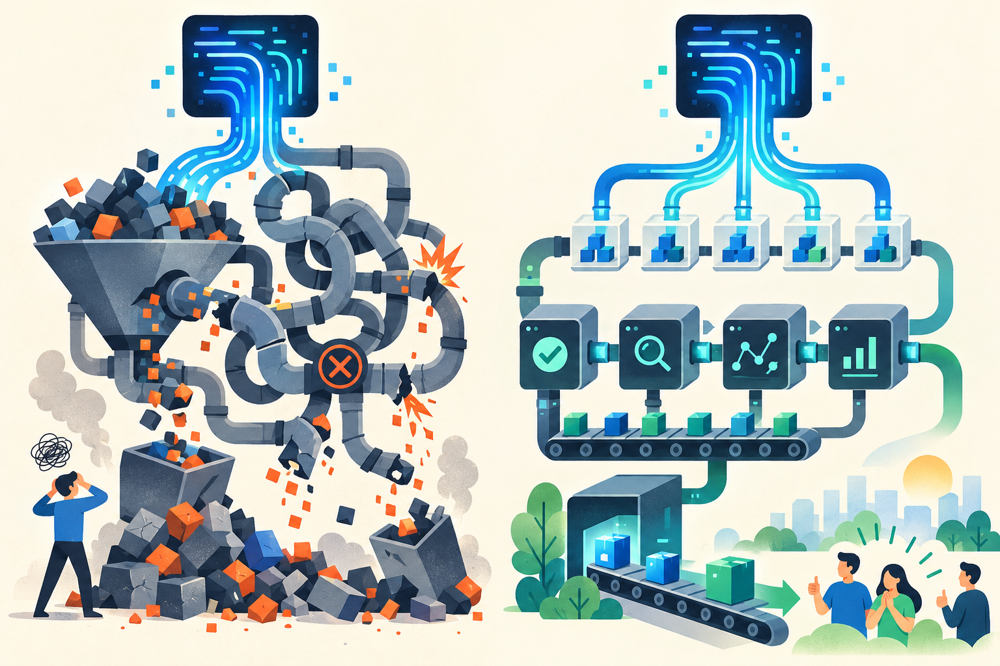
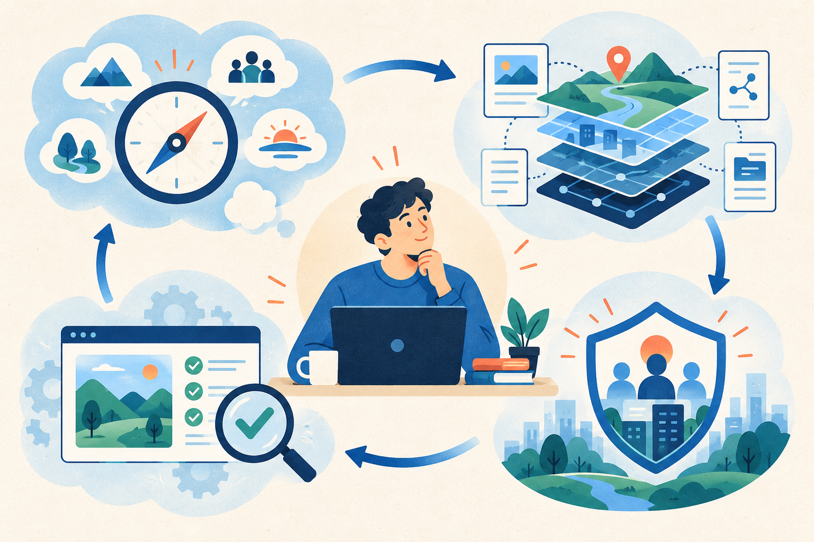

# AI 越会写代码，软件工程师越要会定义问题

> AI 正在快速接管编码任务，但软件工程并不等于代码生产。真正决定工程师价值的，将是定义问题、理解约束、验证结果和承担系统责任的能力。

关于 AI 是否会取代软件工程师，讨论经常从一个演示开始：

给 AI 一段需求，它能生成页面、接口、数据库结构和测试代码。过去需要几天完成的原型，现在可能只要几个小时。

于是，一个看起来很自然的结论出现了：

既然 AI 已经会写代码，软件工程师还剩下什么？

这个问题的问题，在于它默认了一件事：软件工程师的主要工作，就是把需求翻译成代码。

但真实的软件开发，很少从一份清楚、完整、没有矛盾的需求开始。

## AI 会取代大量编码任务

这一点没有必要回避。

样板代码、接口封装、测试用例、配置文件、数据转换、常规页面和局部重构，都越来越适合交给 AI。

随着模型可以读取仓库、执行命令、修改文件并根据测试结果继续迭代，AI 的角色也开始从“代码补全工具”变成“可执行任务的代理”。

Anthropic 对真实使用数据的分析显示，软件开发一直是 AI 使用最集中的领域之一。其 2026 年报告也发现，用户通过拆分任务、补充上下文和持续反馈，可以让模型完成比静态测试中更长的任务。[Anthropic Economic Index](https://www.anthropic.com/research/economic-index-primitives)

这意味着，单纯把明确需求转换成代码的能力，正在迅速贬值。

如果一名工程师的工作边界是：产品经理给出完整需求，架构师决定技术方案，测试人员定义验收标准，自己只负责领取任务和提交代码，那么他的工作确实处在 AI 最容易进入的区域。

问题不在于 AI 会不会取代这种工作方式，而在于速度有多快。

## 但代码只是软件工程的中间产物

软件项目真正的起点通常不是代码，而是一句含糊的话：

“用户觉得这里不好用。”

“系统最近有点慢。”

“我们需要加一个 AI 功能。”

“这个流程能不能自动化？”

这些表达都不是可以直接实现的需求。

工程师需要继续判断：用户真正遇到的是什么问题？这个问题值得用软件解决吗？应该服务哪些人，放弃哪些场景？现有系统允许怎样的改动？错误发生后，谁承担代价？我们如何证明新方案真的有效？

美国劳工统计局对软件开发者职责的描述，也远不止编写程序。它包括分析用户需求、设计系统组成、规划模块如何协作、维护测试以及编写文档；对软件工程师的描述则强调从系统和需求层面规划范围与工作顺序。[美国劳工统计局职业说明](https://www.bls.gov/ooh/computer-and-information-technology/software-developers.htm)

代码，是这些判断经过压缩之后形成的一种表达。

如果问题定义错了，代码写得越快，团队只会越快抵达错误的地方。

*图 1：软件工程闭环。编码只是问题定义、需求、设计、验证和运行反馈之间的一环。*

## AI 提高的是产出速度，不自动提高工程结果

AI 可以在几分钟内生成大量看起来合理的代码。

但软件工程评价的不是代码数量，而是系统是否解决了正确的问题，并且能否在真实环境中持续运行。

METR 在 2025 年进行过一项随机对照研究：16 名熟悉各自开源项目的资深开发者，共完成 246 个真实任务。使用当时的 AI 工具后，任务完成时间平均增加了 19%。开发者主观上却认为 AI 让自己更快了。[METR 研究论文](https://metr.org/Early_2025_AI_Experienced_OS_Devs_Study-paper.pdf)

这项研究有明确边界：样本不大，研究对象是熟悉成熟仓库的资深开发者，使用的也是 2025 年上半年的工具。它不能证明今天的 AI 一定降低效率。

但它说明了一件更重要的事：

**生成代码更快，不等于交付软件更快。**

理解上下文、检查建议、纠正错误、控制改动范围和验证最终行为，同样需要时间。

DORA 的研究也把 AI 描述为一个“放大器”：它既能放大高效组织的优势，也会放大原有流程中的混乱。真正决定收益的，不只是模型能力，还有小批量交付、快速反馈、内部平台、版本控制和用户导向等基础能力。[DORA 2025 报告](https://dora.dev/research/2025/dora-report/)

当生成代码的成本下降，需求错误、架构错误和验证不足反而会变得更昂贵。因为团队可以用更短时间，制造更大规模的错误。

*图 2：AI 是放大器。相同的生成能力进入不同工程系统，会得到完全不同的交付结果。*

## 软件工程师真正承担的是闭环责任

软件工程师与代码生成器之间最重要的区别，不是前者会写更多语言，也不是前者永远比模型聪明。

区别在于谁对结果负责。

一个完整的软件工程闭环至少包括：

1. 从模糊现象中定义真正的问题；
2. 把业务目标转换为可验证的需求；
3. 在成本、性能、安全和时间之间作出取舍；
4. 选择适合现有系统的实现方案；
5. 验证软件在真实环境中的行为；
6. 观察上线结果，并对失败作出反应。

AI 可以参与每一环，甚至独立完成其中越来越多的任务。

但只要需求仍然来自现实世界，只要不同人的目标存在冲突，只要错误需要承担代价，工程工作就不只是“产生一个技术上可行的答案”。

它还需要决定：哪个答案值得实现。

## 如果 AI 以后也会分析需求呢？

这是最有力的反驳。

AI 不会永远停留在写代码。它已经可以整理访谈、分析日志、生成产品方案、比较架构、运行测试，未来当然也可能承担大量需求分析和系统设计工作。

因此，“问题定义是人类永远无法被取代的能力”同样不可靠。

更可能发生的变化是：过去由多人分散完成的工作，会被少数能够驾驭 AI、验证结果并承担责任的人完成。

部分岗位会消失。团队规模可能缩小。初级工程师过去用来成长的简单任务，也可能减少。

软件工程师不会因为“不只会写代码”就自动安全。

真正的变化是，职业价值正在从亲手完成多少实现，转向能否建立一个可靠的人机协作闭环。

## 工程师应该把能力练在哪里

未来值得训练的，不是与 AI 比拼敲键盘的速度，而是四种更接近工程结果的能力。

### 把模糊问题变成可验证目标

不要只接收一句“加一个功能”。先确定它服务谁、解决什么、什么结果算成功，以及这次明确不解决什么。

AI 很擅长回答问题，但它无法替你确认最初的问题是否值得回答。

### 给 AI 提供可工作的上下文

模型不了解团队口头约定、历史妥协、隐含风险和真实用户。

工程师需要把这些散落的信息变成明确的约束、接口、测试和决策记录。未来重要的不只是写提示词，而是建设一个 AI 能正确工作的工程环境。

### 验证行为，而不是欣赏代码

AI 生成的代码可以很整洁，也可以顺利通过静态检查。

但真正需要验证的是：用户路径能不能走通，异常情况如何处理，权限是否正确，数据会不会损坏，系统上线后能不能被观察和恢复。

### 对结果承担责任

AI 可以给出建议，却不会替团队承担事故、成本和用户损失。

工程师必须知道什么时候可以接受模型结果，什么时候必须补充证据，什么时候应该停止自动化并交给人判断。

*图 3：问题定义、上下文建设、行为验证和结果责任，构成 AI 时代的软件工程能力闭环。*

## AI 取代的不是工程师，而是旧的价值定义

AI 会取代一部分软件工程任务，也会让部分岗位减少。

但它首先淘汰的，可能不是“会写代码的人”，而是把自己的全部价值定义为写代码的人。

未来的软件工程师仍然需要理解程序。

只不过，代码会越来越像一种可以快速获得的材料。真正稀缺的是：知道该构建什么、知道哪些约束不能破坏、知道结果是否可信，并愿意对系统最终产生的影响负责。

当 AI 越来越会写代码，软件工程师最重要的工作，反而会发生在写代码之前和之后。
